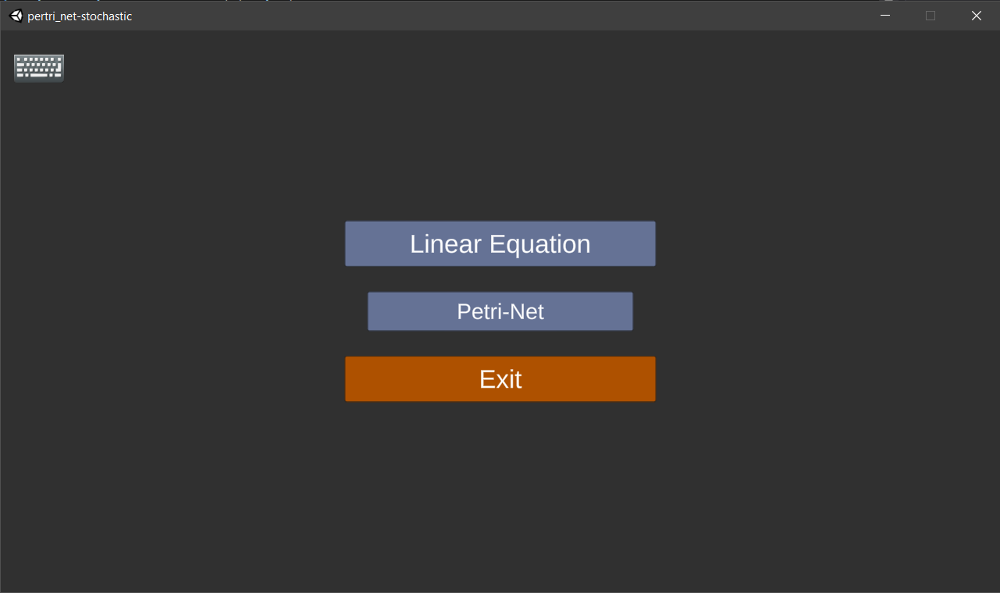
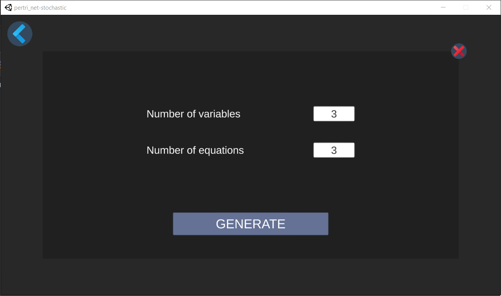
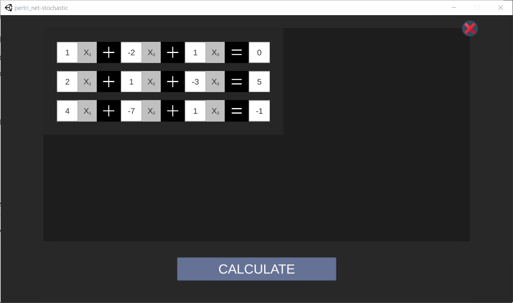
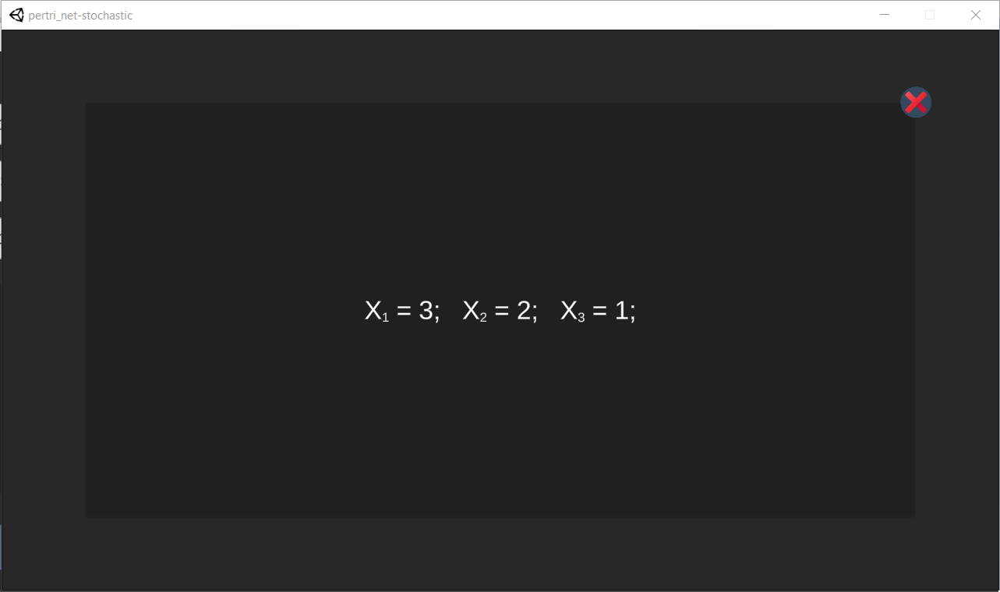
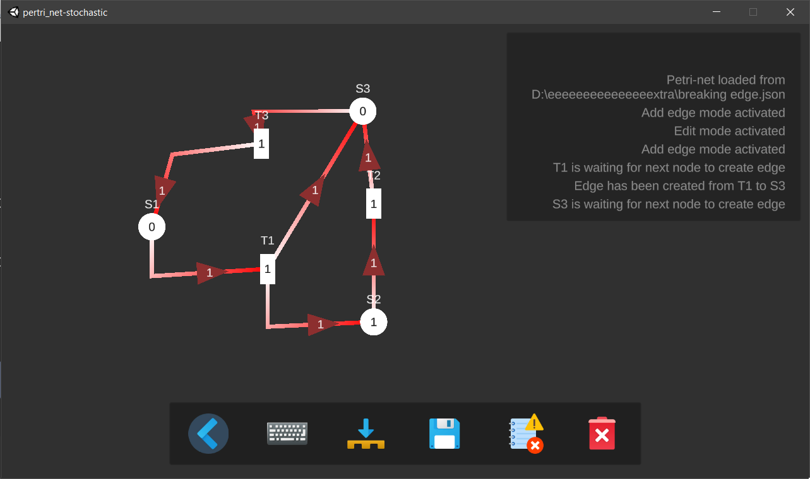
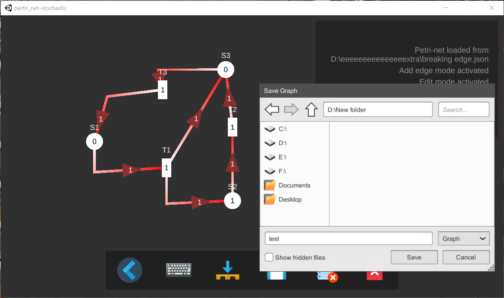

# Linear Equation solver - Draw Petri Net
## Introduction
This project has to separate module inside it. One module can solve linear equations and the other draws and simulates Petri Net. 
You can solve linear eqautions having any number of variables. If the equations hold a unique solution, linear equation can calculate the answer. The linear equation solving part uses the Gaussian Elimination method for solving the equations. Additionally, you can also draw petri net having states, transitions and create edge between them.  
**Executable Project Link**: [https://drive.google.com/file/d/1phRdLnc3fMZq8VAxE6GQ0ZufigSTKWxy/view?usp=sharing](https://drive.google.com/file/d/1phRdLnc3fMZq8VAxE6GQ0ZufigSTKWxy/view?usp=sharing)

## Features and Limitations
### Linear Equation Solver
- Can calculate any number of equations and variables
- Uses gaussian elimination
- Give results if the equations result in a unique solution
### Petri Net
- Can create any number of sates or transition
- Can onnect the nodes with directed edge
- No two same of noded can't be connected
- Has eyboard shortcuts
- Log screen for understanding what is going on
- Saving the current graph(petri net) on local machine
- Loading graph(petri net) from local machine
- Zooming and changing camera position
- Simple UI

## User Manual
- Press s and click to create state.
- Press t and click to create transition.
- Press e and click 2 nodes to create an edge between them.
- Hold shift and click while in edge mode to create straight edge.
- Hold ctrl and click to move the last edge point to current mouse position.
- Press e again to delete unfinished edge.
- Press ctrl+d and click any node or edge to delete them.
- Press ctrl+e and click to edit weight or token value.
- Press ctrl+shift+r to clear everything.
- Press ctrl+shift+x to exit the application.
- Press ctrl+s to save petri-net.
- Press ctrl+l to load petri-net.
- Use arrows to move camera left-right, up-down.
- Scroll mouse wheel to adjust camera zoom.
- Hold right-mouse-button to drag the camera.
- Hold right-mouse-button and scroll mouse wheel to adjust camera drag speed.

# Screenshots
Home Page  

 

After entering Linear Equation  

 

Equations  

 

Result  

 

Drawing graph(petri net)  

 

Saving Petri Net  

